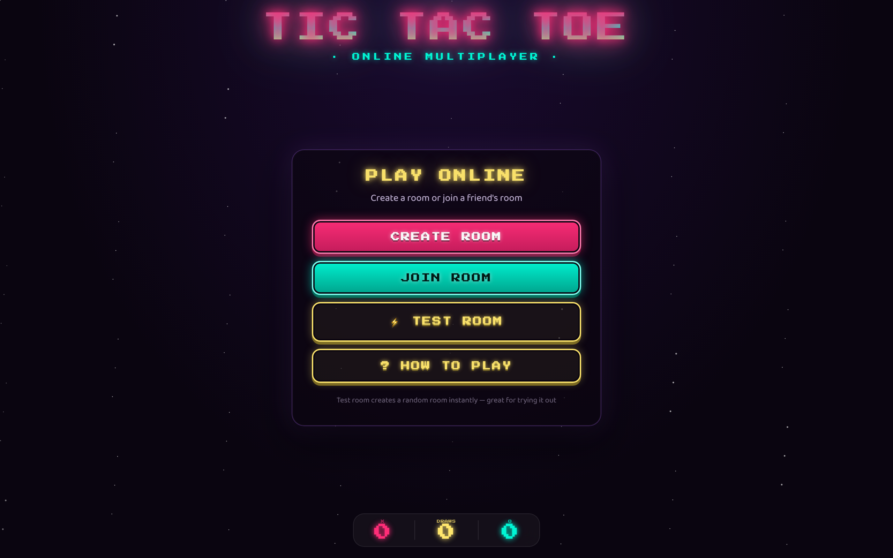
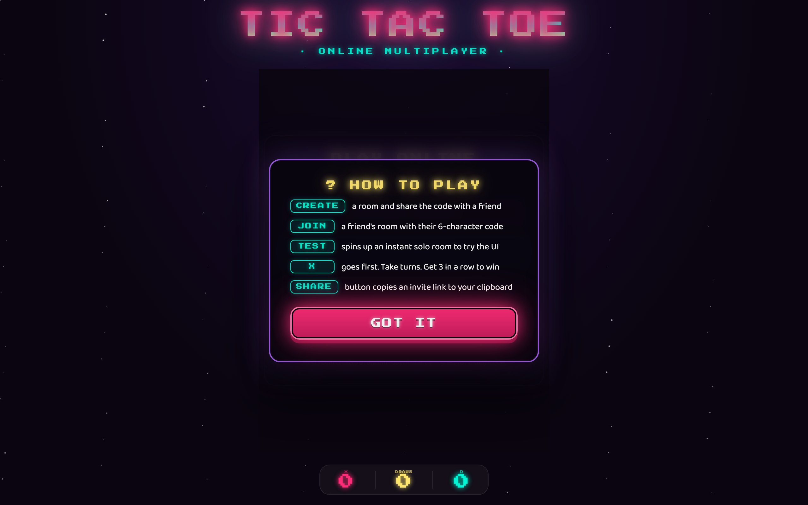
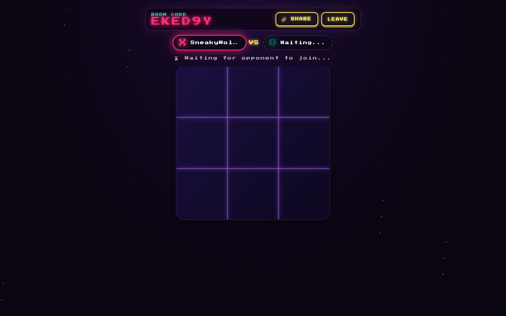
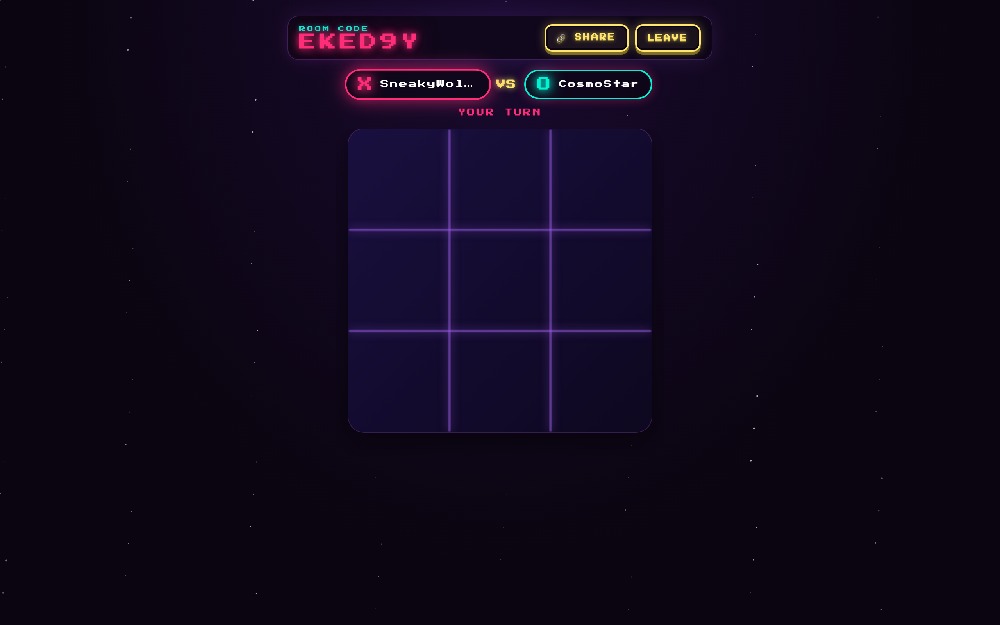
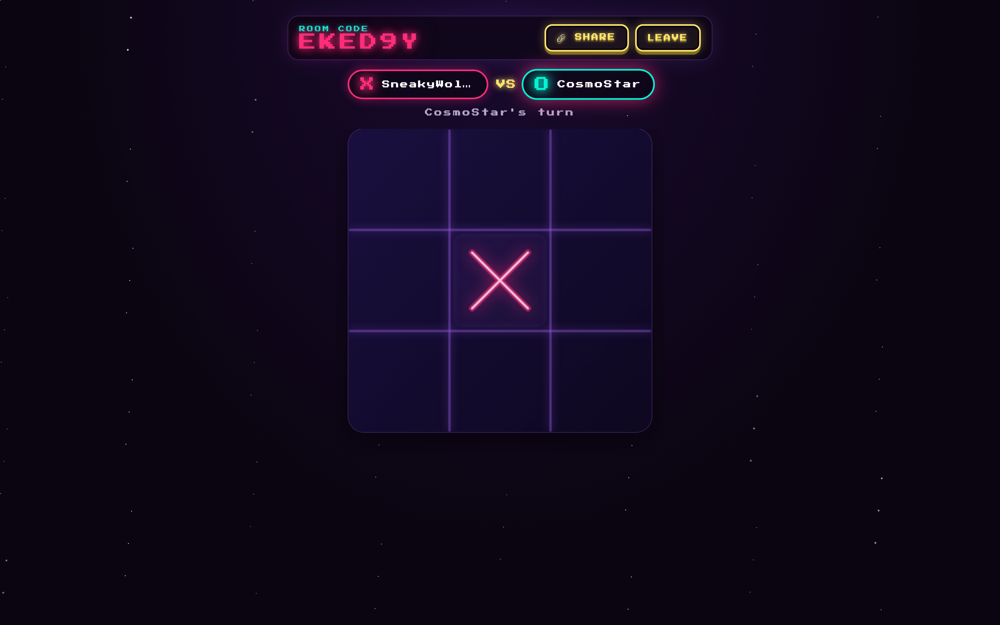
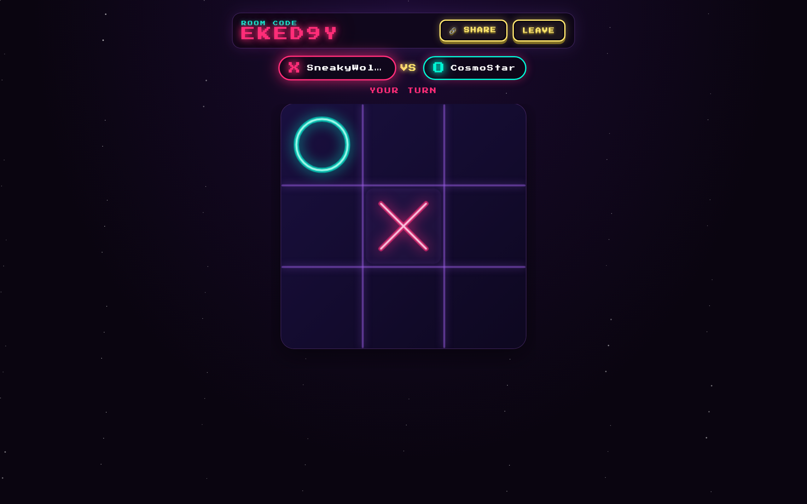
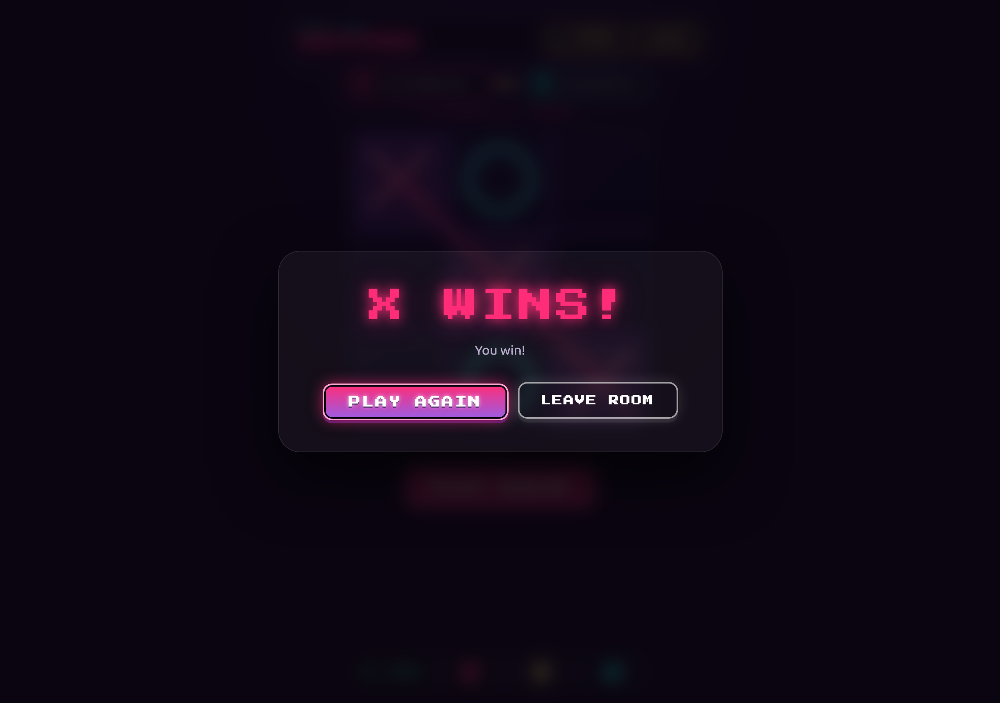

# 🎮 Tic Tac Toe · Online Multiplayer

A retro-arcade styled real-time **two-player tic-tac-toe** built with React, Three.js, and Socket.IO. Create a room, share the code, and play with a friend — no login, no installs, just open the link.



---

## ✨ Features

- **🎲 Instant Rooms** — One click creates a 6-character room code, no signup needed
- **🔗 Share Link** — Copy a full invite link (room code + URL) to your clipboard with one tap
- **⚡ Test Mode** — Spin up a solo room instantly to try the UI without a friend
- **❓ How To Play** — Built-in modal explaining every button
- **🎨 Retro Arcade Style** — Press Start 2P pixel font, neon glow, animated stars background
- **🔄 HMR-Safe Reconnect** — Refresh, network blip, or code edit — you'll rejoin your room automatically
- **📡 Real-time Sync** — Server-authoritative moves, instant board updates via WebSocket

---

## 📸 Screenshots

### Landing Screen
Create or join a room — or jump into a test room instantly.


### How To Play
Built-in help modal so the controls never feel mysterious.



### Room Created — Waiting for Opponent
Share your code or click SHARE to copy an invite link to your clipboard.



### Two Players Joined
Both player badges glow. Your symbol stays highlighted on your turn.



### Mid-Game
Neon X & O drawn on the live board, turn indicators below the player row.



### Multiplayer in Action
Real-time moves from both clients updating instantly.



### Live Score Tracking
Server-authoritative wins/draws, both clients see the same numbers. The green LIVE dot pulses while the game is in progress.




---

## 🚀 Getting Started

### Prerequisites

- **Node.js** ≥ 18 (tested on v22)
- **npm** (or pnpm / yarn)

### Install

```bash
git clone https://github.com/theyashjaiswal/tic-tac-toe-online-multiplayer.git
cd tic-tac-toe-online-multiplayer
npm install
cd server && npm install && cd ..
```

### Run (development — two processes)

Open **two terminals** from the project root.

```bash
# Terminal 1 — Socket.IO backend (port 3001)
cd server && npm run dev

# Terminal 2 — Vite dev server (port 5173)
npm run dev
```

Then open **http://localhost:5173** in two browser tabs:

1. Tab A → click `⚡ TEST ROOM` (auto-creates a random room)
2. Tab B → click `JOIN ROOM`, paste the room code from Tab A's `🔗 SHARE` button

### Production build

```bash
npm run build       # bundles frontend into /dist
node server/index.js
# serve /dist via any static host (nginx, vercel, netlify, etc.)
```

---

## 🏗️ Architecture

```
┌─────────────────────┐         WebSocket          ┌──────────────────┐
│  React + Three.js   │ ◄─────────────────────────► │  Socket.IO       │
│  (Vite, port 5173)  │   /socket.io (proxied)      │  (Node, :3001)   │
└─────────────────────┘                             └──────────────────┘
        │                                                    │
        │ Three.js renders an interactive 3D board          │ Keeps rooms,
        │ with neon X & O sprites drawn on <canvas>          │ players, moves
        │ Framer Motion drives UI animations                 │ Win detection
```

### Frontend

- **React 19** with hooks (state, effect, callback, ref)
- **Three.js + @react-three/fiber** for the animated game board
- **Framer Motion** for button hover transitions, modal pop-in, win overlays
- **socket.io-client** for real-time room sync
- **Vite** with `/socket.io` proxy so the browser only ever talks to port 5173 in dev

### Backend (`/server`)

- **Node.js + Express** HTTP server
- **Socket.IO** for persistent WebSocket rooms
- 6-character random room codes (e.g. `EKED94`) generated server-side
- Server-authoritative move validation (turn order, cell occupancy, win detection)
- Rooms auto-delete when empty; force-end if opponent disconnects mid-game

---

## 🧩 Project Structure

```
tic-tac-toe-online-multiplayer/
├── client/                       # (this folder — the frontend)
│   ├── src/
│   │   ├── App.jsx              # main game, socket.io setup, room logic
│   │   ├── GameBoard.jsx        # Three.js board, neon X/O sprites
│   │   ├── index.css            # arcade-style theme, all components
│   │   └── main.jsx             # React entrypoint
│   ├── index.html
│   ├── package.json
│   └── vite.config.js
├── server/
│   ├── index.js                 # Socket.IO event handlers
│   └── package.json
├── screenshots/                  # README screenshots
└── README.md
```

---

## 🎯 Socket.IO Events

| Event          | Direction   | Payload                  | Description                             |
| -------------- | ------------ | ------------------------ | --------------------------------------- |
| `create_room`  | client → srv | `{ playerName }`         | Create a new room → returns `{ roomCode, symbol }` |
| `join_room`    | client → srv | `{ roomCode, playerName }` | Join existing → returns players + board |
| `leave_room`   | client → srv | —                        | Tell server you're leaving (clean)      |
| `make_move`    | client → srv | `{ index }`              | Play on cell index 0–8                  |
| `play_again`   | client → srv | —                        | Reset the board for a new round         |
| `game_update`  | srv → client | `{ board, currentTurn, … }` | After every move                       |
| `game_reset`   | srv → client | `{ board, currentTurn }` | After `play_again`                      |
| `scores_update`| srv → client | `{ X, O, draws }`           | Live win/draw counters (server-authoritative) |
| `player_joined`| srv → client | `{ players, board, scores }` | New opponent connected                  |
| `opponent_left`| srv → client | `{ players, gameOver }`  | Other player disconnected               |

---

## 🎨 Customizing the Look

All colors live as CSS custom properties at the top of `src/index.css`:

```css
:root {
  --bg-primary:   #0a0510;
  --accent-pink:  #ff2d78;   /* X color, primary buttons   */
  --accent-cyan:  #00f5d4;   /* O color, secondary buttons */
  --accent-yellow:#ffe66d;   /* ghost buttons, subtitle    */
  --accent-purple:#9b5de5;   /* card borders, glow accents */
  /* ...fonts, etc. */
}
```

Tweak those, swap the `Press Start 2P` import in `index.html`, or add your own keyframes — go wild.

---

## 📦 Deployment Notes

- The frontend and backend can be deployed together or separately.
- In production, point vite's `SOCKET_URL` to your server's host (the current default uses the same origin so a single reverse-proxied host works).
- For long-running rooms, add a Redis adapter so multiple socket.io nodes can share room state (`@socket.io/redis-adapter`).
- Persistent rooms, accounts, leaderboards, reconnect tokens — all easy follow-ups; PRs welcome.

---

## 📝 License

MIT © [Yash Jaiswal](https://github.com/theyashjaiswal)

Built as a love letter to 80s/90s arcade aesthetics — neon glow, chunky pixel fonts, instant feedback. Have fun.
